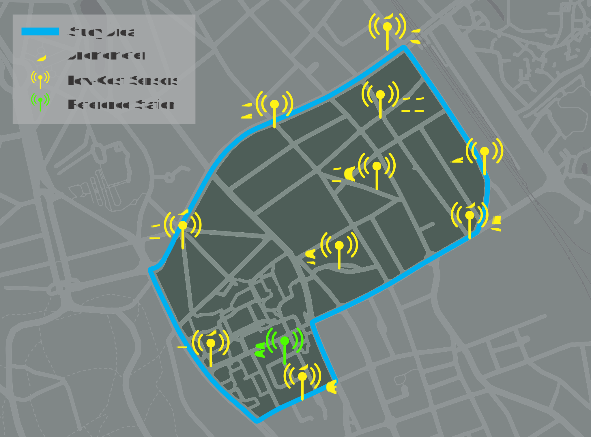

# Ixelles Sensor Data

SPICECO project sensor data for local meteorological and concentrations of pollutant agents data for  Ixelles, Brussels (between ULB-Solbosch and VUB-Etterbeek campuses). Area of interest ~0.75 $km^{2}$ .

# Data sources
**S_Airport (Brussels Airport weather data)**\
Source: [Iowa State University - Environmental Mesonet](https://mesonet.agron.iastate.edu/request/download.phtml?network=BE__ASOS)\
Location: [50.896186, 4.526046](https://maps.google.com/?q=%3C50.896186%3E,%3C4.526046%3E)

**S_Uccle (Royal Observatory of Belgium - Station Code 41R012)**\
Source: [Belgian Interregional Environment Agency (IRCEL - CELINE)](https://geo.irceline.be/sos/static/client/jsClient/?&locale=en)\
Location: [50.79663595794822, 4.358516997983345](https://maps.google.com/?q=%3C50.79663595794822%3E,%3C4.358516997983345%3E)

**S0 (Reference Station at ULB)**\
Source: [Airpointer Portal](https://airpointer-2018-00637.recordum.net/) **(manual download)**\
Location: [50.8126525, 4.382938333](https://maps.google.com/?q=%3C50.8126525%3E,%3C4.382938333%3E)

**S1-11 (Small sensors network in Ixelles)**\
Source: [MacQ - Noolitic Portal Site](https://qsenseair.macq.eu/login?redirect=/macqqsense2/70b3d5e5fffe11bc)\
Or via API **(see SensorData_Request.ipynb)**

All NaN or null values are represented by -9999 or -9999.0 (because the data is exported and stored in **.csv** format). All measured data contained in the S* folders **(NOT THE DUMP FOLDERS)** have the following format/units:

|      **Quantity**      |           **Format/Measurement Units**          |
|------------------------|-------------------------------------------------|
| timestamp              | YYYY-MM-DD HHMMSS                               |
| wind_speed             | m/s                                             |
| wind_direction         | degrees (0N clockwise)                          |
| temperature            | &deg;C                                          |
| pressure               | hPa                                             |
| relative_humidity      | %                                               |
| rain                   | %                                               |
| no                     | $µg/m^{3}$                                      |
| no2                    | $µg/m^{3}$                                      |
| pm1                    | $µg/m^{3}$                                      |
| pm25                   | $µg/m^{3}$                                      |
| pm10                   | $µg/m^{3}$                                      |
| o3                     | $µg/m^{3}$                                      |

# ATTENTION!

$NO$, $NO_{2}$ and $O_{3}$ in **S0** dump folder are initially given in **ppb**. To convert to **$µg/m^{3}$** use the following formulas:

|        **Pollutant**        |   **Conversion Formula**   |
|-----------------------------|----------------------------|
| Carbon Monoxide (CO)        | 1  ppb  = 1.15 $µg/m^{3}$  |
| Nitrogen Monoxide (NO)      | 1  ppb  = 1.23 $µg/m^{3}$  |
| Nitrogen Dioxide ($NO^{2}$) | 1  ppb  = 1.88 $µg/m^{3}$  |
| Ozone ($O^{3}$)             | 1  ppb  = 1.96 $µg/m^{3}$  |
| Sulphur Dioxide ($SO^{2}$)  | 1  ppb  = 2.62 $µg/m^{3}$  |

Source: [Breeze Technologies](https://www.breeze-technologies.de/blog/air-pollution-how-to-convert-between-mgm3-%C2%B5gm3-ppm-ppb/)
